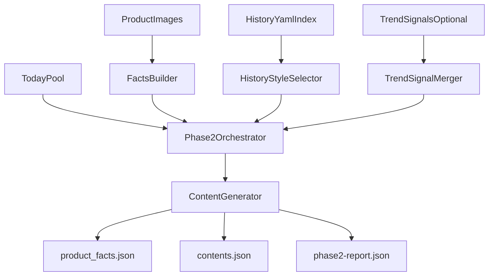

# 新阶段 2 技术方案

## 目标

把阶段 2 从“浏览器抓热门笔记 + 图像分析 + 文案生成”的耦合流程，重定义为“消费稳定输入并产出可发布文案”的编排阶段。

新阶段 2 只解决两件事：

- 生成每个商品的结构化内容草稿
- 为后续发布阶段提供清晰、可追踪、可复跑的产物

不再把用户端实时搜索/详情抓取作为阶段 2 的前置条件。

## 重新定义后的职责边界

### 阶段 2 负责

- 读取商品池与商品图片
- 读取商品事实与风格参考数据
- 生成结构化文案草稿
- 输出统一产物与元数据
- 在部分输入缺失时执行明确降级

### 阶段 2 不再负责

- 用户端登录探测
- 小红书网页端搜索与详情抓取
- 热门笔记实时分析
- 浏览器生命周期管理

这些能力如果还要保留，应移到独立的“研究/采样子系统”，只向阶段 2 提供可选输入文件。

## 模块边界

### 1. 商品输入层

保留 [src/xhs_poster/phase2.py](/Users/levin/.openclaw/workspace/skills/xiaohongshu-product-poster/src/xhs_poster/phase2.py) 作为编排器，但只做输入装配、调度和落盘。

核心输入继续来自：

- [src/xhs_poster/models.py](/Users/levin/.openclaw/workspace/skills/xiaohongshu-product-poster/src/xhs_poster/models.py) 的 `TodayPool`
- 图片目录与商品图片映射
- 配置项 `Settings`

建议把当前这段逻辑保留为编排起点，而不是夹带外部采集：

```72:89:src/xhs_poster/phase2.py
def build_phase2_outputs(
    *,
    keyword: str | None = None,
    contents_per_product: int = 5,
    search_limit: int = 20,
    detail_limit: int = 8,
    settings: Settings | None = None,
) -> Phase2ExecutionResult:
    settings = settings or Settings()
    settings.ensure_directories()
    session = require_authenticated_session("consumer", settings)
    run_headless = session.browser_mode == "headless"
    today_pool = load_today_pool(settings)
```

重定义后，这里应去掉 `require_authenticated_session("consumer")` 以及与热帖抓取直接耦合的步骤。

### 2. 商品事实层

保留 [src/xhs_poster/image_facts.py](/Users/levin/.openclaw/workspace/skills/xiaohongshu-product-poster/src/xhs_poster/image_facts.py)，但明确它的定位是“商品事实输入的一部分”，不是完整真相源。

建议把商品事实拆成两类：

- `visual_facts`：来自图片的低风险视觉事实，如颜色、主体形态、亮度、图像尺寸
- `catalog_facts`：来自商品名或后续结构化商品数据的事实，如品类、材质词、风格词、元素词

要求：

- 阶段 2 只能消费结构化事实，不直接消费浏览器页面
- 字段语义必须准确，避免把“从商品名推断”伪装成“图片确认”

### 3. 风格参考层

新增“历史风格参考”子模块，数据源来自 [references/history-notes/](/Users/levin/.openclaw/workspace/skills/xiaohongshu-product-poster/references/history-notes)。

定位不是热门笔记替代品，而是“店铺历史表达资产”。

建议输入结构：

- `history_style_refs.json`
- 每条记录包含：`product_search_key`、`title`、`content`、`hashtags[]`、`quality_flags[]`、`source_file`

职责：

- 解析 yaml
- 提取标题、正文、标签
- 去重与污染标记
- 按商品聚合为 few-shot 风格参考

### 4. 外部趋势层

把 [src/xhs_poster/hot_notes.py](/Users/levin/.openclaw/workspace/skills/xiaohongshu-product-poster/src/xhs_poster/hot_notes.py) 从阶段 2 主链路中降级为可选增强模块。

它未来可以输出一个标准化文件，例如：

- `trend_signals.json`
- 内容只包括标题模式、正文节奏、标签候选、场景词、情绪词

阶段 2 读取这个文件时遵循：

- 有则增强
- 无则忽略
- 失败不阻断内容生成

### 5. 内容生成层

保留 [src/xhs_poster/content_gen.py](/Users/levin/.openclaw/workspace/skills/xiaohongshu-product-poster/src/xhs_poster/content_gen.py) 作为“结构化输入 -> 结构化文案”的核心模块。

其输入优先级应改成：

1. 商品事实
2. 历史风格参考
3. 外部趋势信号（可选）
4. 默认类目兜底策略

当前 prompt 中的 `hot_notes_analysis` 仍可保留，但应允许它为空或为默认值，不再是强依赖。

## 输入定义

### 必选输入

- `today-pool.json`
  - 商品列表
  - 商品图片映射
- 商品图片文件
- LLM 配置

### 推荐输入

- `history_style_refs.json`
  - 由历史 yaml 清洗后得到
  - 按商品提供风格参考

### 可选输入

- `trend_signals.json`
  - 来自独立研究流程
  - 提供趋势词、标题模式、标签候选

### 阶段 2 运行时输入契约

- 没有 `trend_signals.json` 也必须能跑通
- 没有 `history_style_refs.json` 也必须能跑通，但效果下降
- 没有某商品图片时，应在结果中记录该商品失败原因，而不是静默跳过

## 输出定义

建议阶段 2 只产出 3 类主文件：

### 1. `product_facts.json`

每个商品的阶段 2 实际消费事实快照。

包含：

- 商品基础信息
- 图片事实
- 商品名推断事实
- 选中的历史参考样本 ID
- 选中的趋势信号摘要

作用：便于追踪“LLM 到底吃了什么”。

### 2. `contents.json`

保留现有主产物定位，但增强字段。

每个商品除 `drafts` 外，建议增加：

- `status`: `ok | partial | failed`
- `generation`: 来源、模型、错误
- `input_refs`: 使用了哪些事实源
- `warnings`: 如“无历史样本”“无趋势信号”“图片缺失”

### 3. `phase2-report.json`

新增统一报告，用于给 CLI 和后续阶段消费。

包含：

- 总商品数
- 成功数 / 失败数 / 部分成功数
- 缺图商品列表
- 仅模板生成商品列表
- 未使用趋势信号商品列表
- 关键路径耗时

## 数据流




## 降级策略

### 商品级降级

- 无图片：该商品标记 `failed`，写入 `phase2-report.json`
- 无历史样本：继续生成，标记 `warnings`
- 无趋势信号：继续生成，标记 `warnings`
- LLM 失败：回退本地模板，标记 `generation.source = llm_fallback`

### 阶段级约束

- 只要还有至少 1 个商品生成成功，阶段 2 就可返回成功，但报告中必须显式列出失败商品
- 不允许“静默跳过商品后仍返回全部成功”的行为

## 建议的模块拆分

### 保留并收缩

- [src/xhs_poster/phase2.py](/Users/levin/.openclaw/workspace/skills/xiaohongshu-product-poster/src/xhs_poster/phase2.py)
  - 只保留编排和落盘
- [src/xhs_poster/content_gen.py](/Users/levin/.openclaw/workspace/skills/xiaohongshu-product-poster/src/xhs_poster/content_gen.py)
  - 只保留生成逻辑
- [src/xhs_poster/models.py](/Users/levin/.openclaw/workspace/skills/xiaohongshu-product-poster/src/xhs_poster/models.py)
  - 扩展为阶段契约定义

### 新增建议

- `src/xhs_poster/history_notes.py`
  - 解析和清洗历史 yaml
- `src/xhs_poster/facts_builder.py`
  - 合并 `visual_facts + catalog_facts + optional trend/style refs`
- `src/xhs_poster/phase2_report.py`
  - 统一汇总结果、警告与失败原因

### 降级为独立流程

- [src/xhs_poster/hot_notes.py](/Users/levin/.openclaw/workspace/skills/xiaohongshu-product-poster/src/xhs_poster/hot_notes.py)
  - 不再作为 phase2 主依赖
  - 改为独立研究任务或预处理任务

## 关键设计决定

- 阶段 2 的主输入应是“商品事实”，不是“热门笔记网页内容”
- 历史 yaml 的定位应是“风格参考”，不是“商品事实来源”
- 趋势信号是增强项，不是阻断项
- 编排层只负责调度，不负责浏览器采集
- 所有降级都必须可观测、可追踪、可落盘

## 预期收益

- 阶段 2 不再因为用户端登录、网页结构变动、风控页而整体失败
- 生成链路更稳定，可批量运行
- 输入来源更清楚，后续调优更容易定位问题
- 历史 yaml 能被真正利用，但不会污染商品事实

