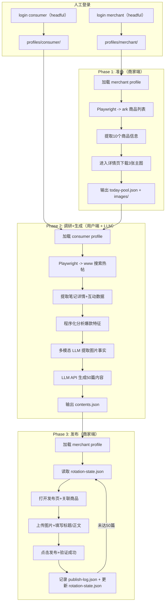

# 重构小红书商品笔记自动发布 Skill

## 当前执行顺序

当前默认执行顺序不采用“Phase 1 / 2 / 3 全部粗略实现后再统一返工”的路线，而采用：

1. 先完整实现 `Phase 1`
2. 再优先进行 `Phase 3` 的页面探测与最小闭环
3. 然后实现 `Phase 2`
4. 最后统一做工业化优化

具体里程碑、原因和验收口径见：

- `@.cursor/plans/实施顺序与里程碑_9a3c1f2d.plan.md`

## 核心改动

- **替换 agent-browser** -> Playwright（操作商家端 ark.xiaohongshu.com）
- **替换 xiaohongshu-mcp** -> Playwright（操作用户端 `www.xiaohongshu.com`）
- **替换 Shell 脚本 + 内嵌 Python** -> 纯 Python 包，uv 管理依赖
- **替换模板随机拼接** -> LLM 内容生成（程序分析热帖 + LLM 仿写）
- **零外部二进制依赖** -> 只依赖 Python 包 + Chromium（playwright install）
- **改为 Skill 友好协议** -> 默认机器可读 JSON，便于 OpenClaw 稳定调用

## 双站点架构

本项目涉及两个独立站点，Session 分开管理：

- **商家端** `ark.xiaohongshu.com` — Phase 1（获取商品/图片）、Phase 3（发布笔记）
- **用户端** `www.xiaohongshu.com` — Phase 2（搜索/分析热门笔记）

两个站点的鉴权均**无法通过账号密码自动登录**（需扫码/短信验证），因此登录流程必须由人工在 headful 浏览器中完成。为提升稳定性，登录态主方案不再是单独的 `storage_state` JSON，而是每站点独立 `user_data_dir`；`storage_state` 仅作为调试或导出能力。

## 架构设计




## 两种运行模式

**模式1: Cron 全自动**（工具独立完成全流程）

```bash
uv run xhs-poster run    # phase1 -> phase2（含 LLM 生成）-> phase3
```

**模式2: AI 调度**（OpenClaw 逐步调用，可介入内容创作或覆写内容）

```bash
# AI 调用各阶段，可在中间环节读取数据、覆写 contents.json
uv run xhs-poster phase1 --json
uv run xhs-poster phase2 --json
uv run xhs-poster phase3 --json
```

两种模式下，Phase 3 都只认 `contents.json`。工具可自动生成内容，OpenClaw 也可在 Phase 2 后读取并覆写内容，再继续调 Phase 3。

## 项目结构

```
~/.openclaw/workspace/skills/xiaohongshu-product-poster/
├── pyproject.toml                  # uv 项目配置（Python 3.13）
├── .env                            # LLM API 配置（不提交）
├── .env.example                    # 配置模板
├── SKILL.md                        # 面向 AI 的使用手册
├── QUICKREF.md                     # 快速参考
├── src/xhs_poster/
│   ├── __init__.py
│   ├── cli.py                      # typer CLI 入口
│   ├── config.py                   # pydantic-settings 配置管理
│   ├── models.py                   # Pydantic 数据模型
│   ├── browser.py                  # 双站点 Playwright 上下文管理
│   ├── merchant.py                 # 商家端 Page Object（商品列表+发布页）
│   ├── consumer.py                 # 用户端 Page Object（搜索+笔记详情）
│   ├── image_facts.py              # 图片事实提取
│   ├── phase1.py                   # 阶段1：准备商品池+图片
│   ├── phase2.py                   # 阶段2：调研热帖+LLM生成内容
│   ├── phase3.py                   # 阶段3：批量发布
│   ├── content_gen.py              # LLM 内容生成（OpenAI 兼容接口）
│   ├── hot_notes.py                # 热帖爬取+分析
│   ├── publish_manager.py          # 配额/轮转/断点续传
│   └── io.py                       # 机器优先 JSON 输出与错误封装
└── scripts/                        # 保留旧脚本（过渡期兼容，后续删除）
```

## 关键设计决策

### 1. 双站点登录态管理

两个站点各自独立的 Playwright profile 目录，作为登录态主方案：

```
~/.openclaw/workspace/xiaohongshu-data/
├── profiles/
│   ├── merchant/          # ark.xiaohongshu.com user_data_dir
│   └── consumer/          # www.xiaohongshu.com user_data_dir
├── auth-merchant.json     # 可选导出的 storage_state
└── auth-consumer.json     # 可选导出的 storage_state
```

`browser.py` 提供统一接口：

- `launch_merchant_profile()` — 使用 merchant `user_data_dir` 启动持久化上下文
- `launch_consumer_profile()` — 使用 consumer `user_data_dir` 启动持久化上下文
- `login_merchant()` — headful 模式打开 ark 登录页，人工完成后写入 merchant profile
- `login_consumer()` — headful 模式打开 www 登录页，人工完成后写入 consumer profile
- `export_storage_state(site)` — 可选导出调试用 JSON，不参与主流程

Session 过期检测：每个 phase 开始时验证 session 有效性，过期则输出结构化错误：

```json
{"error": "SESSION_EXPIRED", "site": "merchant", "message": "商家端登录已过期，请执行 xhs-poster login merchant"}
```

### 2. 人工登录流程

两个站点都需要扫码/短信验证，无法自动化。`login` 命令的行为：

1. 启动 Playwright **headful** 模式（`headless=False`）
2. 导航到对应登录页
3. 终端提示"请在浏览器中完成登录..."
4. 轮询检测登录成功（URL 变化 / 特定 cookie 出现）
5. 保留对应站点 profile，必要时额外导出 `storage_state`
6. 关闭浏览器

```bash
uv run xhs-poster login merchant    # 登录商家端
uv run xhs-poster login consumer    # 登录用户端
```

### 3. 用户端热帖爬取（替代 xiaohongshu-mcp）

`consumer.py` + `hot_notes.py` 用 Playwright 直接操作 `www.xiaohongshu.com`：

- **搜索页**：`www.xiaohongshu.com/search_result?keyword=发夹&sort=general`
  - 等待瀑布流加载（`page.wait_for_selector('.note-item')`）
  - 提取笔记卡片：标题、点赞数、作者、封面、note_id
  - 按互动数据筛选高热度笔记（如点赞 > 500）
- **详情页**：`www.xiaohongshu.com/explore/{note_id}`
  - 提取完整正文、标签、收藏数、评论
  - 每篇间隔随机 1~3 秒，避免触发风控

`hot_notes.py` 负责对爬取数据做程序化分析：

- 标题结构分布（疑问式/感叹式/合集式）
- 高频 emoji 统计
- 热门标签组合
- 文案节奏模式

### 4. 图片事实提取

现有 `SKILL.md` 的核心约束是“只基于图片事实写内容，不胡乱猜测”，所以计划中必须显式定义图片事实来源。

主方案：

- 使用多模态 LLM 对每个商品的 3 张主图做一次结构化提取
- 输出字段如：主色、材质观感、图案元素、配件元素、发夹类型、风格关键词、可确认卖点、禁止臆测点
- 只允许后续内容生成引用这些结构化事实

回退方案：

- 如果当前 Provider 不支持图片输入，`image_facts.py` 用本地 Python 做低风险提取
- 仅输出安全事实，如主色系、是否高亮/透明、是否存在大面积珍珠/金属/蝴蝶结等显著元素
- 回退模式下，文案 prompt 需自动收紧，避免材质、使用体验等高风险猜测

输出文件建议新增：

```
~/.openclaw/workspace/xiaohongshu-data/
└── image-facts.json
```

### 5. LLM 内容生成

`content_gen.py` 通过 httpx 调用 **OpenAI 兼容接口**（不引入 openai SDK）：

配置方式（`.env`）：

```env
LLM_BASE_URL=https://api.moonshot.cn/v1
LLM_API_KEY=sk-xxx
LLM_MODEL=kimi-k2.5
```

支持切换到 DeepSeek、通义千问等任何 OpenAI 兼容 Provider，只需修改 `.env`。

生成逻辑：

- 输入：热帖分析报告 + 单个商品信息 + `image-facts.json` 中的结构化图片事实 + 内容约束规则
- 输出：5 篇不同角度的笔记（标题/正文/标签），结构化 JSON
- 每个商品一次 LLM 调用（prompt 包含 5 个角度要求），10 个商品共 10 次调用

### 6. 商家端 Page Object

`merchant.py` 封装两类页面操作：

**ProductListPage**（Phase 1 使用）：

- `get_products(limit=10)` -> 从商品管理页提取商品列表
- `get_product_images(product_id)` -> 进入编辑页，提取 qimg 域名主图并下载

**PublishPage**（Phase 3 使用）：

- `open_publish_page(product_id)` -> 打开发布页（自动关联商品）
- `click_manual_create()` -> 点击"手动创作"
- `switch_to_image_text()` -> 切换"上传图文"
- `upload_images(paths)` -> 上传图片（`set_input_files`）
- `fill_title(title)` -> 填写标题
- `fill_content(content)` -> 填写正文（contenteditable）
- `add_topic(topic)` -> 添加话题
- `click_publish()` -> 点击发布
- `verify_success()` -> 验证 URL 跳转确认成功
- `screenshot_on_failure(path)` -> 失败时自动截图

每个操作使用 Playwright 的 `wait_for_selector` / `wait_for_url` 替代硬编码 `sleep`，提升稳定性。

### 7. 严格轮流与精确恢复

现有 skill 的业务规则不是“尽量均匀发”，而是“固定今日 10 商品 + 严格顺序轮转 + 从准确位置恢复”。因此需要独立状态文件，而不是只依赖发布日志推算。

建议新增：

```
~/.openclaw/workspace/xiaohongshu-data/
└── rotation-state.json
```

状态至少包含：

- `date`
- `today_pool_product_ids`
- `current_product_index`
- `current_angle_index`
- `published_records`
- `failed_attempts_by_product`
- `last_success_at`

状态推进规则：

1. Phase 1 首次创建当天商品池时初始化 `rotation-state.json`
2. Phase 3 每成功发布 1 篇，原子更新游标
3. 中断恢复时优先读取 `rotation-state.json`，而不是从日志反推
4. 只有当当前商品已完成本轮角度时，才推进到下一个商品
5. 达到 50 篇或全部商品完成 5 篇后停止

### 8. CLI 输出规范（面向 AI 消费）

作为给 OpenClaw 调用的 skill，CLI 采用“机器优先”协议：

- **默认 stdout 输出 JSON**
- **stderr 输出过程日志**
- `**--human` 或 `--pretty` 才输出适合人读的格式**

```bash
# 正常输出
uv run xhs-poster stats
# {"today_total": 23, "remaining": 27, "products": {"id1": 3, "id2": 5, ...}}

# 错误输出
uv run xhs-poster phase1
# {"error": "SESSION_EXPIRED", "site": "merchant", "message": "..."}
```

退出码规范：

- `0` — 成功
- `1` — 一般错误
- `2` — Session 过期（需人工登录）
- `3` — 配额已满

### 9. 数据文件格式（保持兼容并补充状态）

路径和格式与旧方案一致：

```
~/.openclaw/workspace/xiaohongshu-data/
├── profiles/merchant/              # 商家端 profile（新增）
├── profiles/consumer/              # 用户端 profile（新增）
├── auth-merchant.json              # 商家端 session（新增）
├── auth-consumer.json              # 用户端 session（新增）
├── today-pool.json                 # Phase 1 输出
├── images/{product_id}/{1,2,3}.jpg # Phase 1 输出
├── image-facts.json                # Phase 2 中间产物（新增）
├── hot-notes-analysis.json         # Phase 2 输出（分析报告）
├── contents.json                   # Phase 2 输出（50篇内容）
├── publish-log.json                # Phase 3 输出（发布记录）
└── rotation-state.json             # Phase 3 状态机（新增）
```

## 依赖清单（pyproject.toml）

- `playwright` — 浏览器自动化（操作两个站点）
- `pydantic` + `pydantic-settings` — 数据模型 + .env 配置管理
- `httpx` — HTTP 客户端（调 LLM API、下载图片）
- `typer` + `rich` — CLI 框架 + 终端美化输出
- `Pillow` — 图片校验（确认下载的图片有效）

## 与旧方案的对比

- **Phase 1**: `agent-browser eval` + shell `grep` 提取 -> **Playwright locator + 结构化提取**
- **Phase 2**: `xiaohongshu-mcp` HTTP API + 模板拼接 -> **Playwright 爬取用户端 + LLM 仿写**
- **Phase 3**: `agent-browser click/fill` + base64 hack 上传 -> **Playwright set_input_files + fill**
- **Session**: `agent-browser state load/save`（单一文件）-> **双 `user_data_dir` 主方案 + 可选 storage_state 导出**
- **登录**: 无专门支持 -> **headful login 命令 + 自动检测 + profile 持久化**
- **图片事实**: 商品名推测或模板兜底 -> **多模态图片事实提取 + 本地规则回退**
- **恢复策略**: 从日志和计数近似推断 -> **rotation-state 状态机精确恢复**
- **错误排查**: `agent-browser screenshot` -> **Playwright trace + 失败自动截图**
- **调用方式**: AI 通过 shell 脚本间接调用 -> **默认 JSON stdout + stderr 日志的 Skill 协议**

